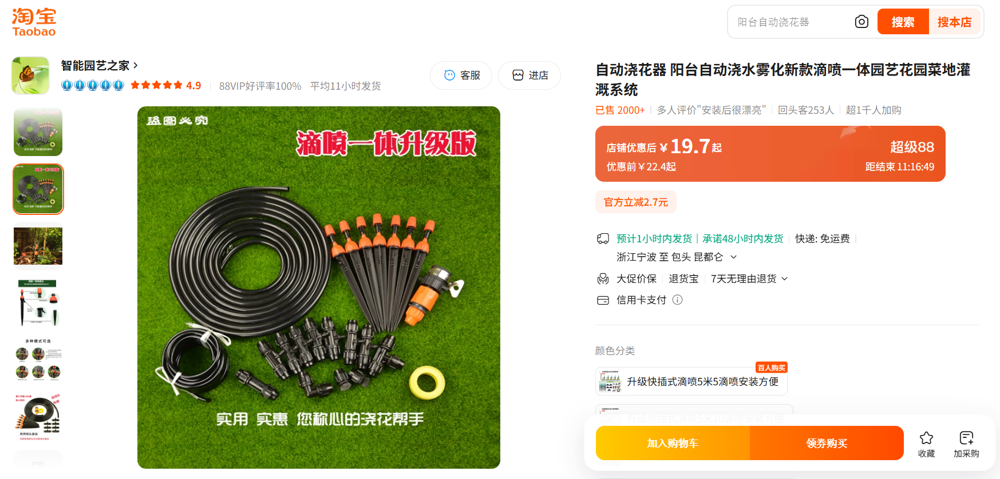
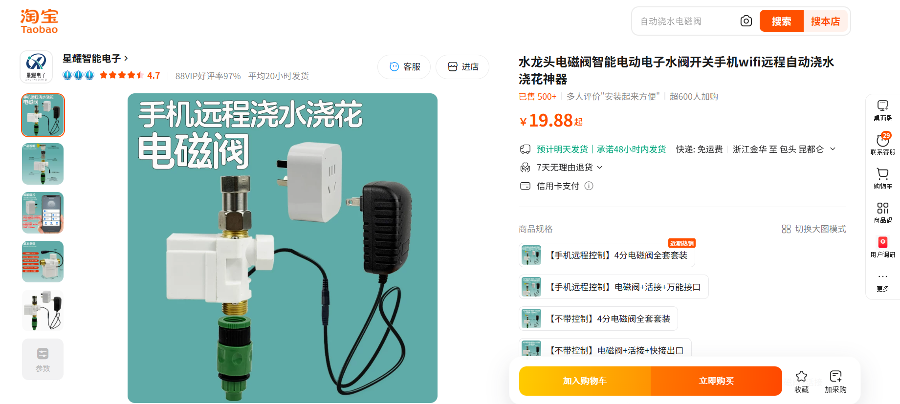
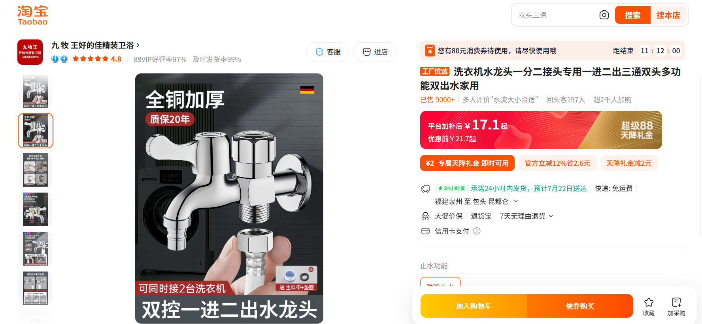
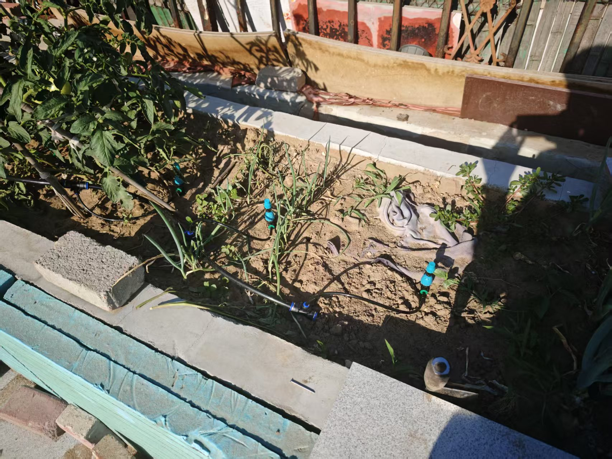
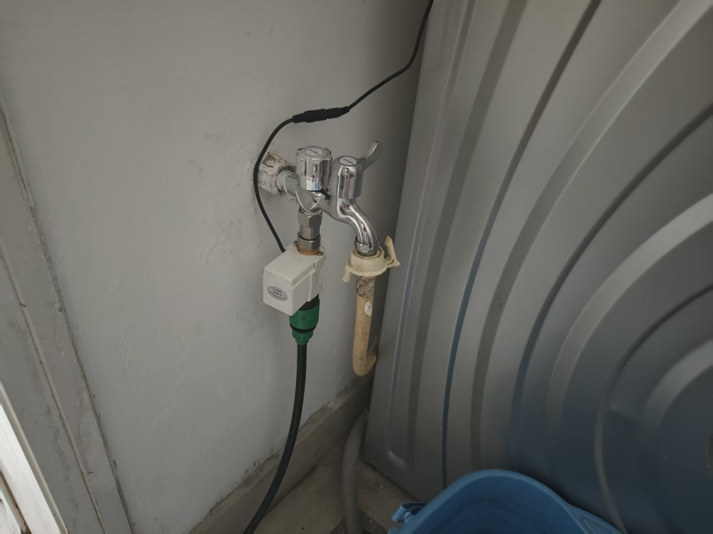
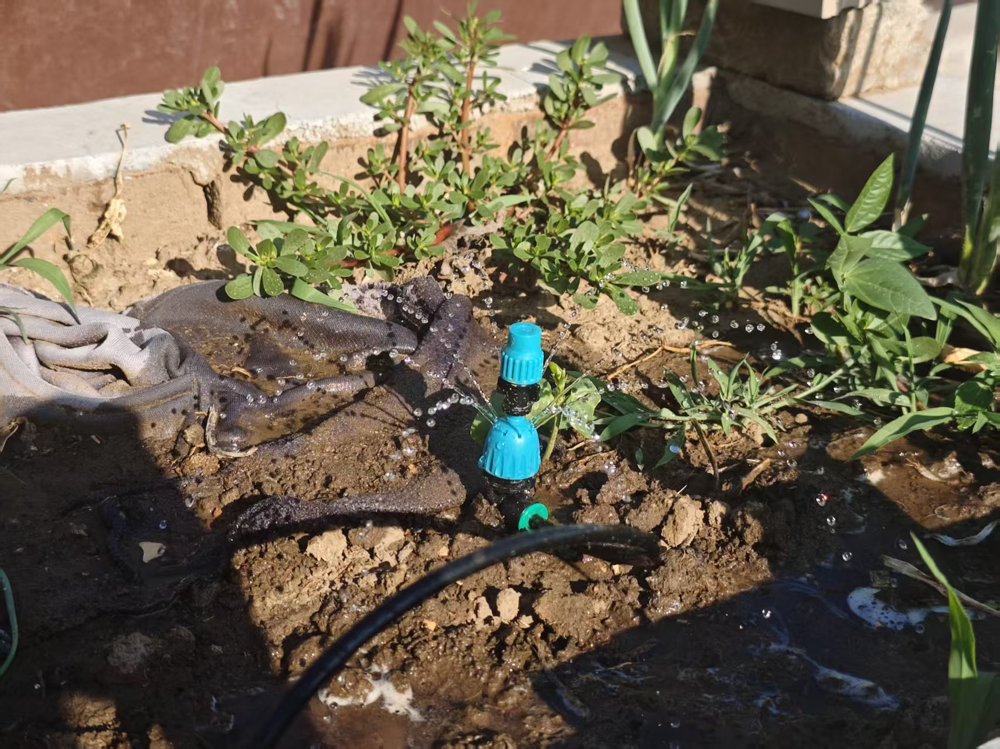

最近，我接到一项任务：为阳台上种的菜设计一套自动浇水系统。

我测量了阳台上花盆的大小：长度3米，宽度和深度均为0.6米。另外，花盆距离最近的水龙头直线距离大约为4米。

为了完成这一项目，我将任务的完成度分为了三个层级：
1. 完成机械结构。这一步完成后，可以通过人工手动控制来浇水。
2. 完成简单的控制器。这一步完成后，可以实现定时浇水或者远程控制。
3. 完成基于土壤湿度测量的控制器。这一步完成后，浇水可以完全自动化，只要检测到缺水就自动浇水。

那么，首先我开始设计机械结构。

机械结构的设计很容易想到：只要在水龙头上接一根软管，拉到阳台的花盆，在花盆中安装若干喷头即可。在控制方面，我准备使用电磁阀控制，这样便于下一步改造为远程或定时控制，而且手动控制也很方便：插拔插头即可。

接下来进入设备采购阶段。软管与喷头的采购很容易：市面上已经有成熟的解决方案。

实际上可以直接购买带有定时阀门的方案以完成层级2，但是这不利于层级3的设计。因此我还是只购买了纯机械式的喷头。

至于电磁阀，可以买到的种类很多。有直接连接软管的种类，也有连接标准水管的种类。不过最后，我找到了这个商品：

它同时包含了电磁阀、电源以及软管接头。虽然它标榜“自动控制”，但实际上是靠智能插座完成。因此我仍然只购买了不带控制系统的版本。

最后，我想要用于浇水的那个水龙头已经被洗衣机占用。因此，我还买了一个双接口的水龙头：

水龙头阀门可以单独关闭，在电磁阀的基础上可以再增加一层保险。

所有设备到货后，就可以开始安装。安装过程十分简单，很快整套设备就可以投入使用。

