书接上文，我开始设计层级2：完成简单的控制器，实现定时控制/远程控制。

为了实现这一任务，我首先想到的就是使用ESP32。只要连接WiFi，它可以轻松地远程控制，输出数字信号。当然，为了实现真正的电路控制，还需要一枚MOS管之类的元件。

ESP32很容易买到。不过，基于ESP32的开发板与基于ESP32-S3等其他型号的开发板有一定区别，引脚数也不同。由于本次任务只需要最基础的WiFi功能，我购买了最简单的30 Pin ESP32开发板：

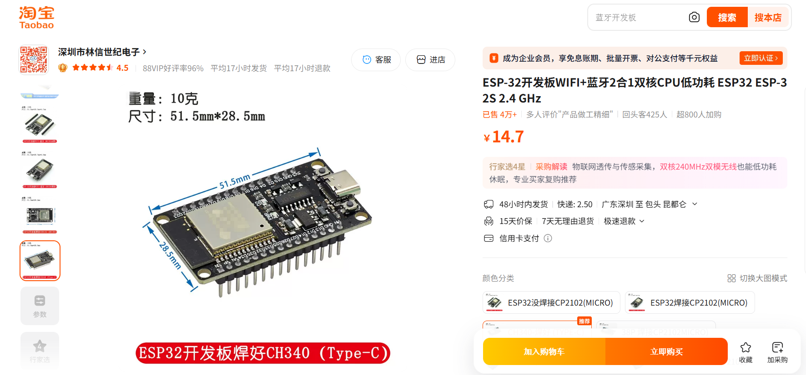

接下来还需要解决供电问题。上一期已经提到电磁阀自带一个12V电源，需要把12V电压降到5V供开发板使用。为了方便，我直接在同一家店买了可调的降压模块：

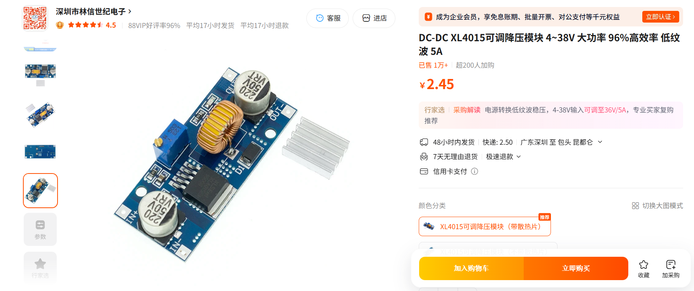

然后就需要考虑控制电路相关元件的选型。此外，为了兼容第3层级（根据土壤湿度自动浇水），还需要设计通信电路。

在DeepSeek的帮助下，我确定了控制元件：IRLZ44N。作为一个大功率MOS管，它很适合驱动电磁阀。另外，通信电路我采用了I2C通信协议（虽然后来证明这是一个错误的选择）。

完成元件选型后，我开始了电路板设计。

电路板中最重要的就是基于IRLZ44N的开关电路：

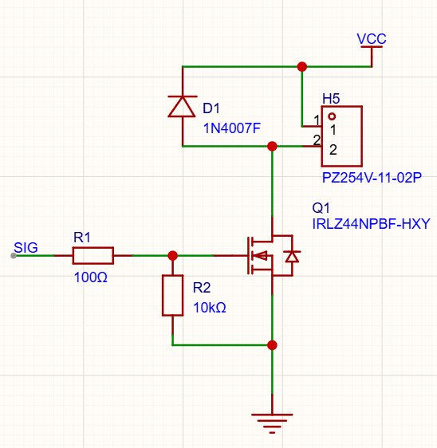

这一电路除了IRLZ44N MOS管，还包括：
- 在控制引脚和MOS管之间串联一个 $100\mathrm{\Omega}$ 的电阻，用于限流。
- 控制引脚用一个 $10\mathrm{k\Omega}$ 的电阻下拉。由于ESP32在开机过程中引脚呈高阻输入态，这个下拉电阻可以保证电磁阀在开机过程不启动。
- 一个二极管（在Gemini的建议下选用1N4007）反向并联在电磁阀两侧，用于消耗电磁阀开关时可能出现的反向电流。

此外，通信电路也需要两个上拉电阻，这是I2C协议的要求。

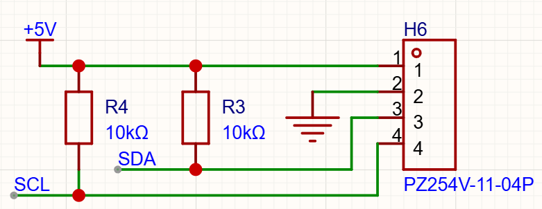

除了这些电路外，就只需要一些连接开发板以及降压模块的引脚，以及一个12V的电源适配器接口。整体原理图如下：

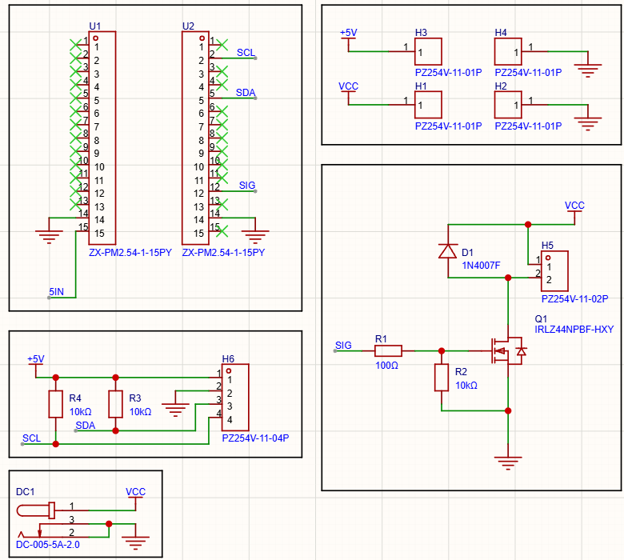

有了原理图之后，可以容易地画出电路板：

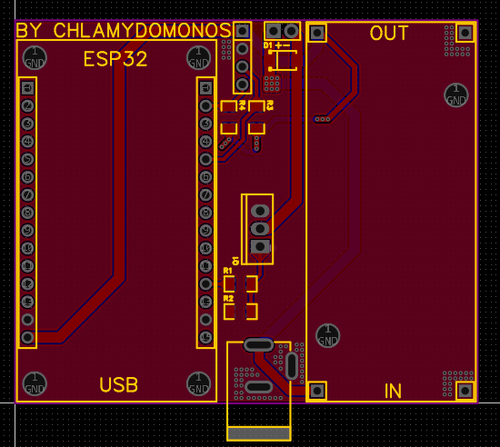

接下来就是交给嘉立创免费打样。经过5天的漫长等待后，电路板终于到货：

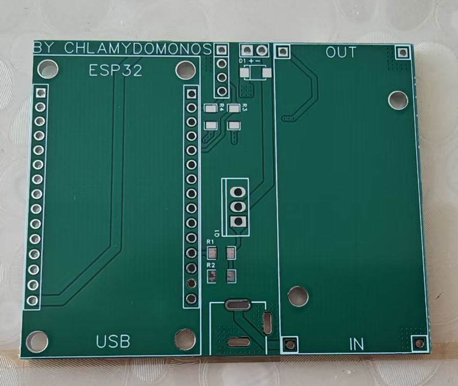

首先焊接电阻、二极管等小元件：

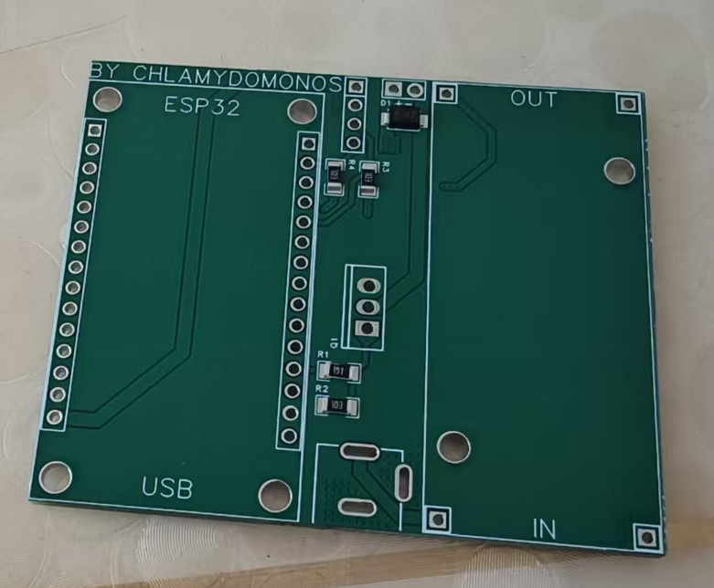

再焊接IRLZ44N，引脚和电源适配器：

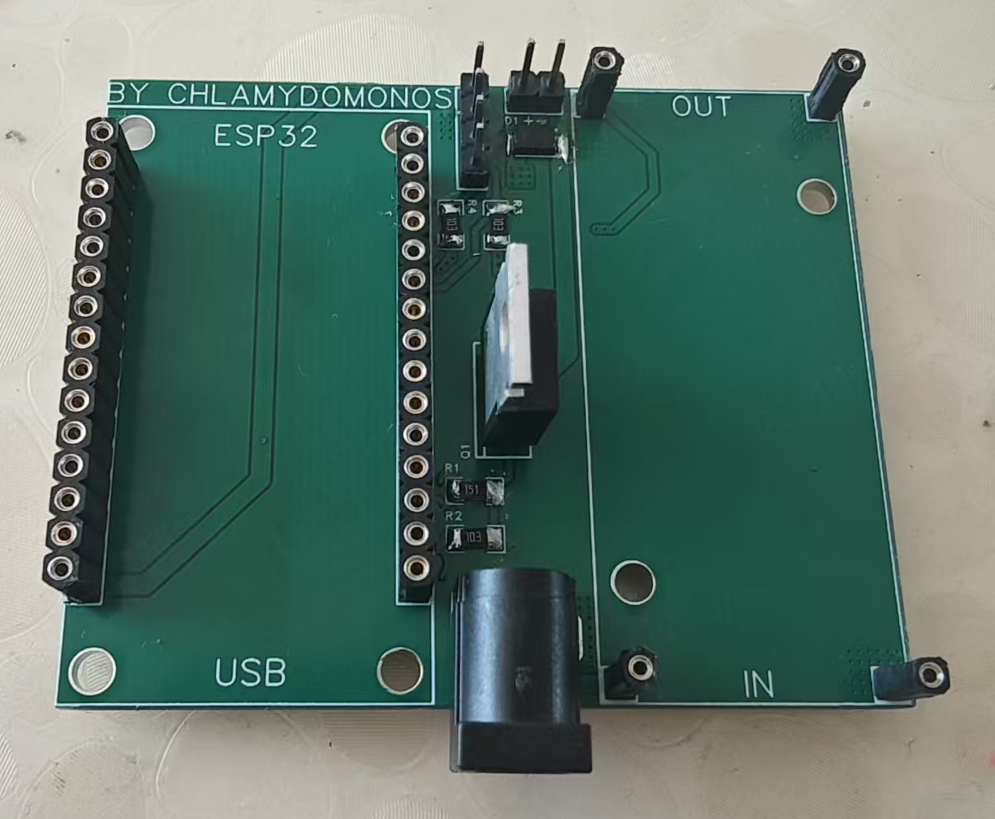

然后插上可调降压模块。这一模块默认不降压，需要调节其上的电位器把电压降至5V。

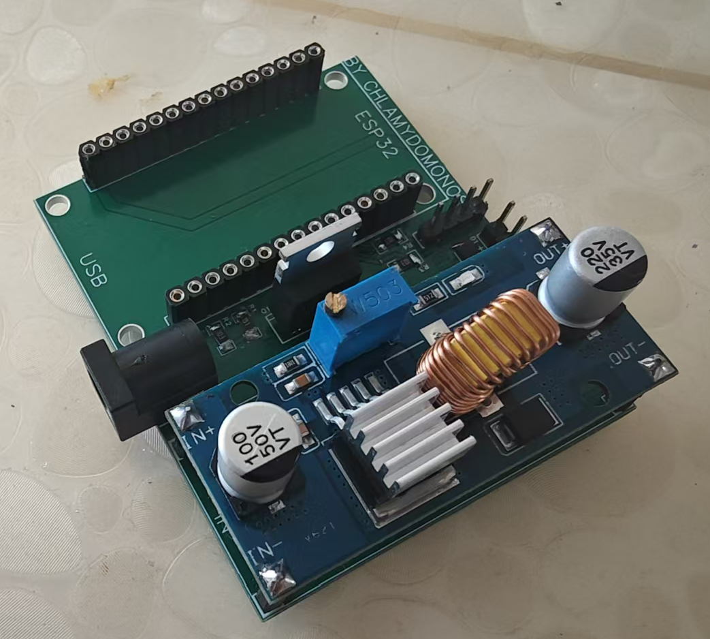

最后，插上ESP32开发板，整个控制器完工。

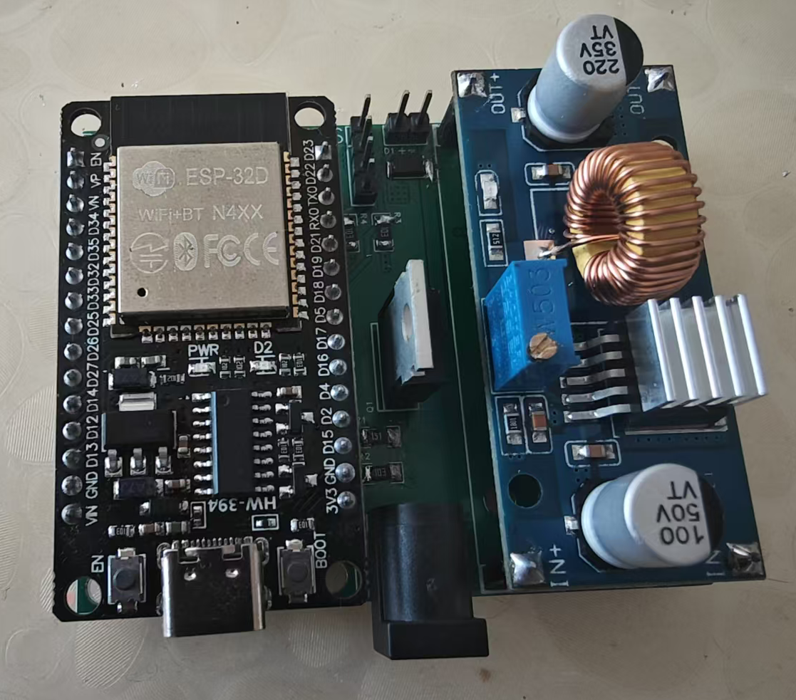

理论上来说，控制器对于层级2的任务没有任何问题。因此，我直接开始测试它。我编了一个极简的程序，来验证开关的可用性。

```cpp
bool on = false;
bool changed = false;

void setup() {
    pinMode(2, OUTPUT);
    digitalWrite(2, LOW);
    Serial.begin(115200);
}

void loop() {
    while (Serial.available()) {
        int data = Serial.read();
        if (data == 'a') {
            on = !on;
            changed = true;
        }
    }

    if (changed) {
        digitalWrite(2, on);
        Serial.println(on);
        changed = false;
    }
}
```

程序正常烧录并运行。然而，就在我打算使用万用表测量开关打开和关闭状态下电磁阀引脚之间的电压时，意外发生了。

我设计的控制板上，并排的两个针脚用于连接电磁阀，其中左侧的为12V正极。然而，它旁边并排的4个针脚是为通信电路预留的，而最上方的为5V正极。我在使用万用表时，表针不小心同时碰到了两个针脚。结果，12V电压瞬间涌入了ESP32开发板，导致开发板烧毁。

不论如何，我需要重新购买ESP32。因此，我也开始重新设计电路板。