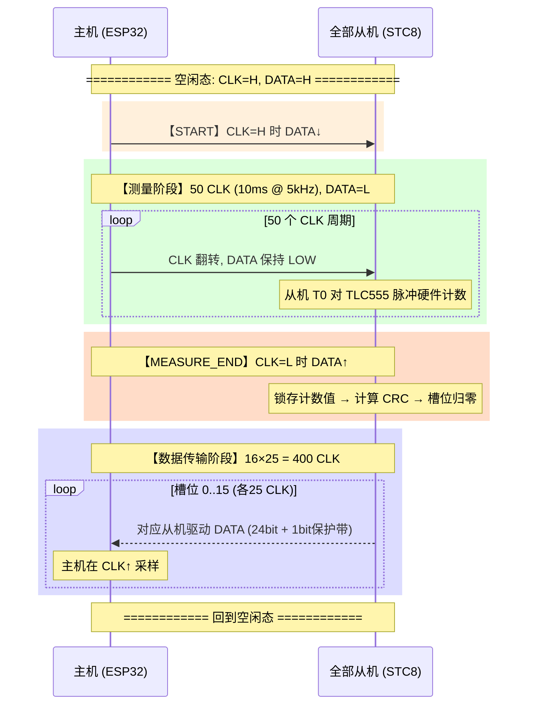
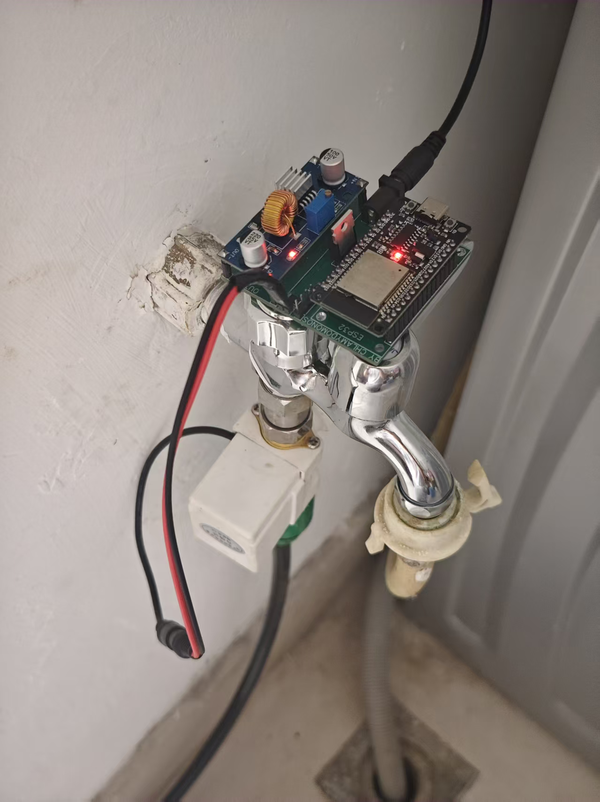
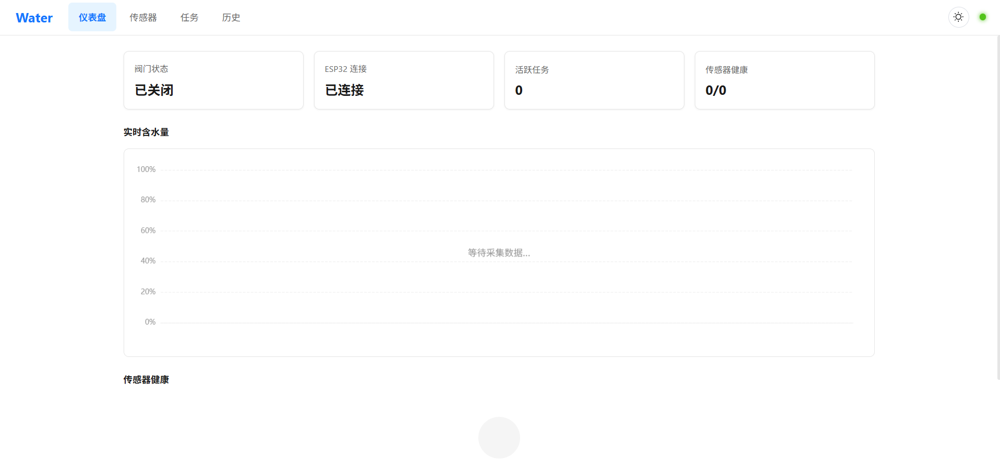
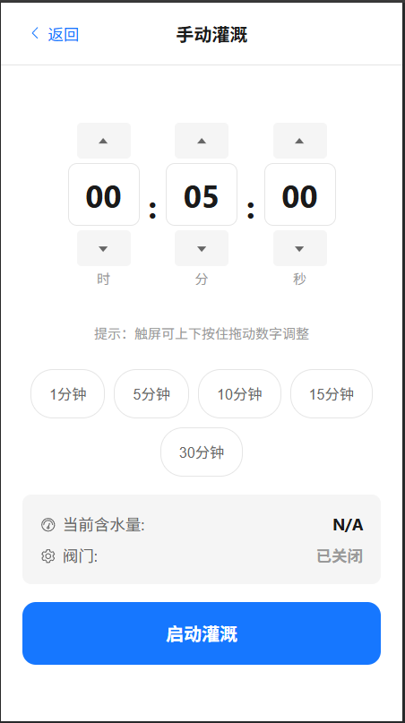
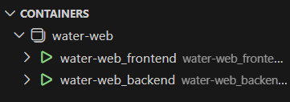
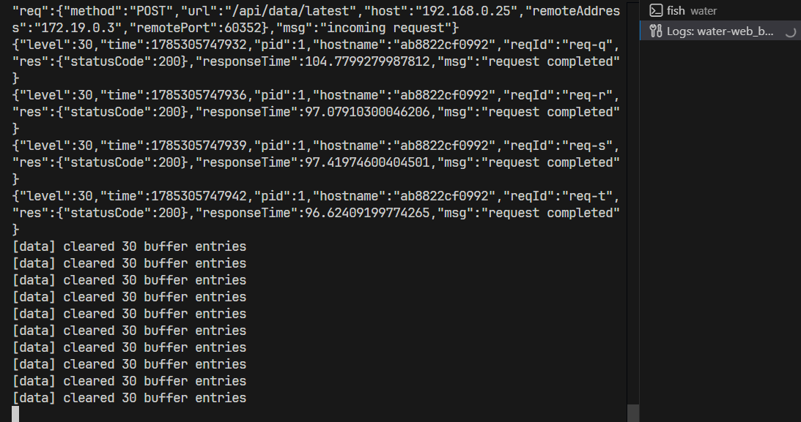

时隔数天，虽然我重新设计的电路板还没有到货，但我重新购买的ESP32已经到货。因此，我决定先继续使用失败的第一版设计，并开始开发软件。

# ESP32软件设计

首先是ESP32端的软件设计。它需要完成以下功能：
- 连接WiFi，与服务器通信。在我的设计方案中，ESP32只完成最底层的控制和数据采集，其他更复杂的工作都由服务器完成。
- 收集湿度传感器数据。由于我准备采用单片机自己设计湿度传感器，这部分可以自定义。
- 通过RGB LED显示系统状态。当然，第一版设计的电路板上并没有RGB LED。但这一功能还是应该先设计出来，以便移植到第二版。

## 传感器通信协议

那么，首先我开始考虑最复杂的湿度传感器数据收集。本来，我打算使用I2C协议。我用STC8G1K17A单片机设计传感器，而这一单片机支持I2C协议。然而，有一个巨大的问题：I2C协议抗干扰能力极差，对于总线长度的要求是小于1米。在我的应用场景中，总线的总长度达到大约10米。这直接给I2C判了死刑。

因此，我开始设计一种类似I2C的协议。一开始，我打算使用和I2C几乎相同的设计：每个传感器（从机）固定一个地址，主机发送一个带有地址的请求，然后对应地址的从机发送响应。然而，我突然意识到，由于我只想测量每个传感器的数据，实际上可以使用更暴力的方法：主机发出一个请求信号，每个从机依次发送数据。

有了这个想法后，我本来想借鉴令牌环网络的实现方式：一个从机发送完数据后，通知下一个从机开始发送。然而，在DeepSeek的提醒下，我才发现：从机只需要简单地根据自己的地址计算发送数据的时间，依次发送即可。于是，在DeepSeek的帮助下，我很快设计出了ESP32和土壤湿度传感器之间的通信协议：



根据这个协议，主机每发出一个请求信号，从机向主机发送16位的数据以及8位的CRC校验码。时钟频率仅有5kHz，远低于I2C的100kHz，保证其抗干扰能力。每次采集耗时大约90毫秒，对于每秒采集一次的应用场景已经够用。

## 网络通信协议

然后需要考虑ESP32和服务器之间的通信。一开始，我打算使用HTTP，使用JSON传递数据。然而，我很快意识到，这还是太臃肿了。既然HTTP基于TCP，我干脆直接以TCP为基础设计一个二进制通信协议，避免HTTP复杂的请求体、JSON解析等问题。

于是，我在DeepSeek的帮助下很快设计出了协议：

### 请求帧（外部服务器 → ESP32）

```
┌──────────┬──────────┬──────────┬──────────┬────────────┬────────────┬──────────┐
│  Magic   │  Magic   │   Seq#   │ Command  │ Payload Len│  Payload   │  CRC16   │
│  0x57    │  0x41    │   u8     │   u8     │   u16 LE   │  Len bytes │  u16 LE  │
│  'W'     │  'A'     │          │          │            │            │          │
└──────────┴──────────┴──────────┴──────────┴────────────┴────────────┴──────────┘
  字节 0     字节 1     字节 2     字节 3      字节 4-5      字节 6..     末尾 2 字节

  总帧头 = 6 字节
  CRC 覆盖范围: [Seq#, Command, Payload Len(u16), Payload]
  CRC 不覆盖: Magic 字节
```

### 响应帧（ESP32 → 外部服务器）

```
┌──────────┬──────────┬──────────┬──────────┬────────────┬────────────┬──────────┐
│  Magic   │  Magic   │   Seq#   │  Status  │ Payload Len│  Payload   │  CRC16   │
│  0x57    │  0x41    │   u8     │   u8     │   u16 LE   │  Len bytes │  u16 LE  │
│  'W'     │  'A'     │          │          │            │            │          │
└──────────┴──────────┴──────────┴──────────┴────────────┴────────────┴──────────┘

  CRC 覆盖范围: [Seq#, Status, Payload Len(u16), Payload]
```

| 字段 | 大小 | 描述 |
|------|:---:|------|
| Magic | 2 bytes | 固定 `0x57 0x41` ("WA" = Water Assistant)，用于帧同步和协议识别 |
| Seq# | 1 byte | 序列号，由外部服务器生成，ESP32 在响应中原样返回，用于匹配请求-响应对 |
| Command | 1 byte | 请求命令码（仅请求帧） |
| Status | 1 byte | 响应状态码（仅响应帧） |
| Payload Len | 2 bytes | 负载长度（小端序），范围 0~65535 |
| Payload | N bytes | 命令参数或响应数据 |
| CRC16 | 2 bytes | CRC-16-CCITT 校验值（小端序），覆盖 `[Seq# .. Payload 末尾]` |

## ESP32实现

在这之后，我开始编写实际程序。我采用Arduino IDE的ESP32兼容库，用VSCode配合Arduino插件开发。不过，开发过程中遇到一个问题：Arduino插件自动生成的C++ Intellisense配置文件缺少一些头文件。我只好手动找到这些头文件，并写了一个NodeJS脚本来将它们自动添加到Intellisense配置文件中。

Arduino ESP32支持FreeRTOS。这是一个简单的实时操作系统。因此，编写上述程序很容易：在FreeRTOS中创建两个任务，分别负责TCP服务器监听和传感器数据收集即可。传感器数据保存在一个长为512的环形队列中，外部服务器每30秒请求一次。至于电磁阀控制，由于逻辑十分简单，写在TCP服务器中即可。

协议具体细节由DeepSeek帮我实现。很快，我就完成并烧录了ESP32端软件。于是，我将其连接到电磁阀，并开始测试。



测试发现，ESP32的网络连接极不稳定，时常掉线，无法Ping通。经过研究，这是因为我有两个同SSID的路由器，而ESP32恰好处于两个路由器信号强度基本相同的地方，导致它疯狂地在两个路由器之间反复横跳，因此难以连接网络。我修改了程序，让它根据路由器的MAC地址连接，网络连接就变得十分稳定。

# 服务器软件设计

ESP32的问题解决后，就需要开始设计服务器。服务器将会运行在客厅的一块树莓派4B上。由于树莓派对于这种简单任务来说算力还是太强了，服务器的设计反而变得很简单。我果断采用我最熟悉的Typescript全栈方案，以及基于Vue的前端。

使用AI辅助，我很快设计好了前端界面，并投入运行。



这一网页不仅可以控制定时浇水/手动浇水，也给将来集成传感器，实现层级3留下了兼容性。

网页同时还做了移动端适配，在移动端可以方便地手动浇水：



最后，我还设计了一个Cloudflare页面，用于通过域名`water.chlamydomonos.xyz`快捷访问系统。该页面会检测用户和系统是否在一个局域网中，如果在则自动跳转到系统网页。

通过Docker把系统部署到树莓派上，并启动系统。系统运行十分正常。



