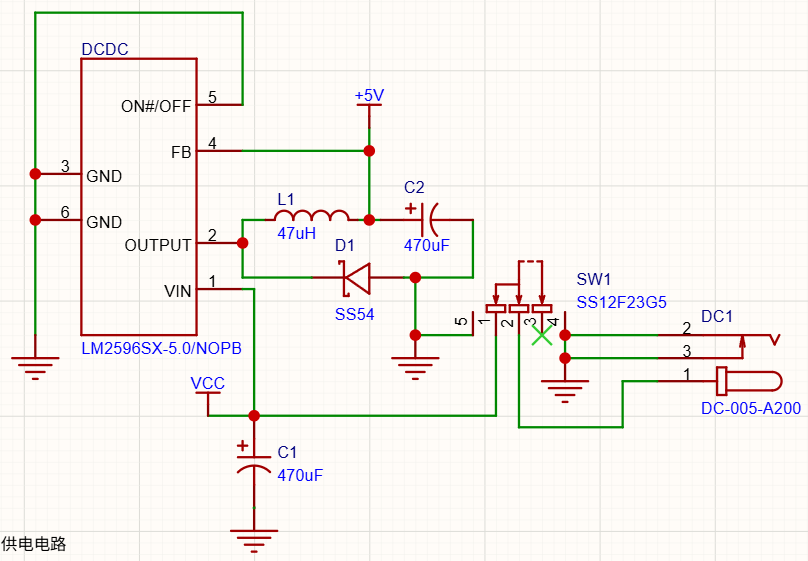
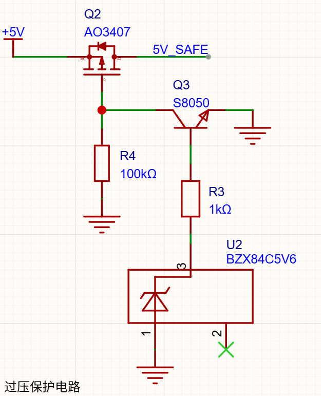
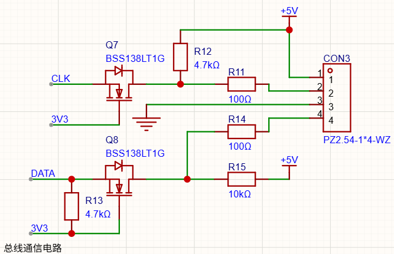
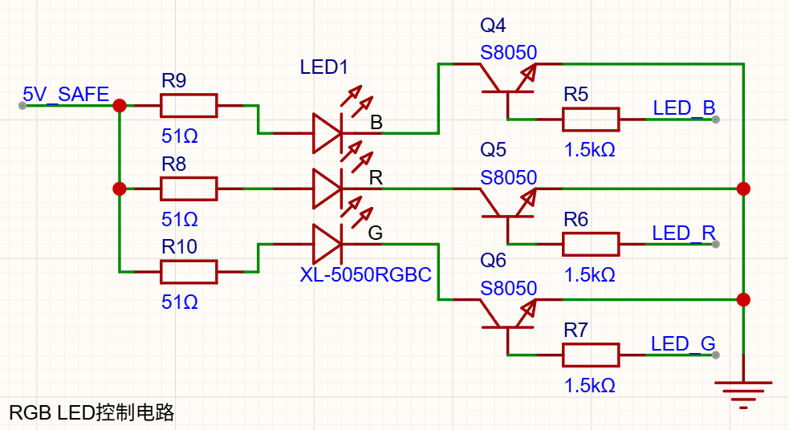
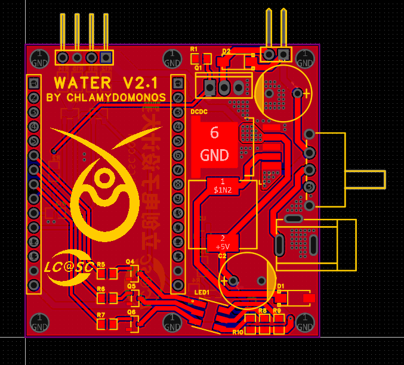
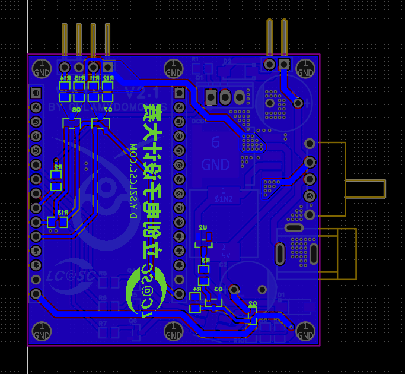
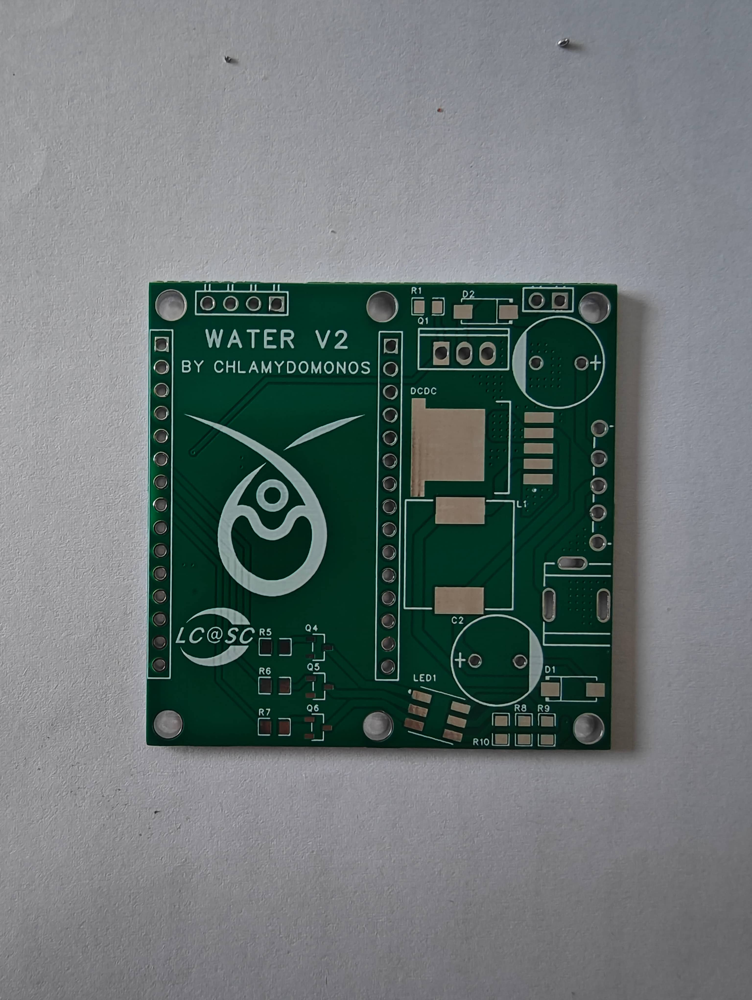
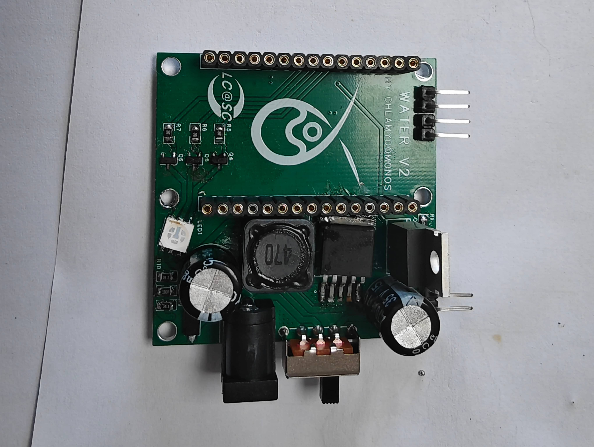
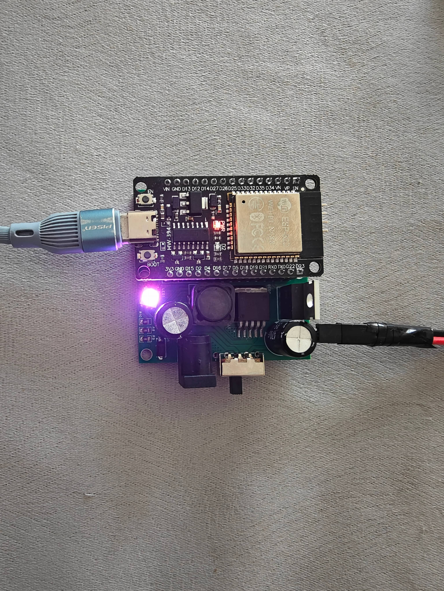

从失败的第一版设计吸收教训后，我重新设计了第二版主机硬件。

首先，我意识到使用成品降压模块是不必要的，会增大PCB面积。于是，我基于LM2596S自行设计了降压电路。

其次，第一版设计失败的根本原因是12V电压灌入5V供电导致的。因此，我在AI的辅助下设计了一个过压保护电路：通过一个MOS管、一个三极管和一个齐纳二极管，在5V供电超压的情况下自动切断电路。

第三，虽然ESP32的IO接口可以承受5V电压，但考虑到设备需要长期运行，我还是把与传感器通信的电路增加了BSS138电平转换。

最后，我还增加了一枚RGB LED，用于简要显示设备工作状态。

电路设计完成后，开始绘制PCB：

{{video::"../../images/water/4/7.mp4","loop"}}

PCB的尺寸十分紧凑，仅有5\*5cm。

接下来就是交给嘉立创打样，很快PCB就生产了出来：

焊接上所有元件：

{{video::"../../images/water/4/9.mp4"}}

插上ESP32，并上传软件：

主机部分彻底完成。