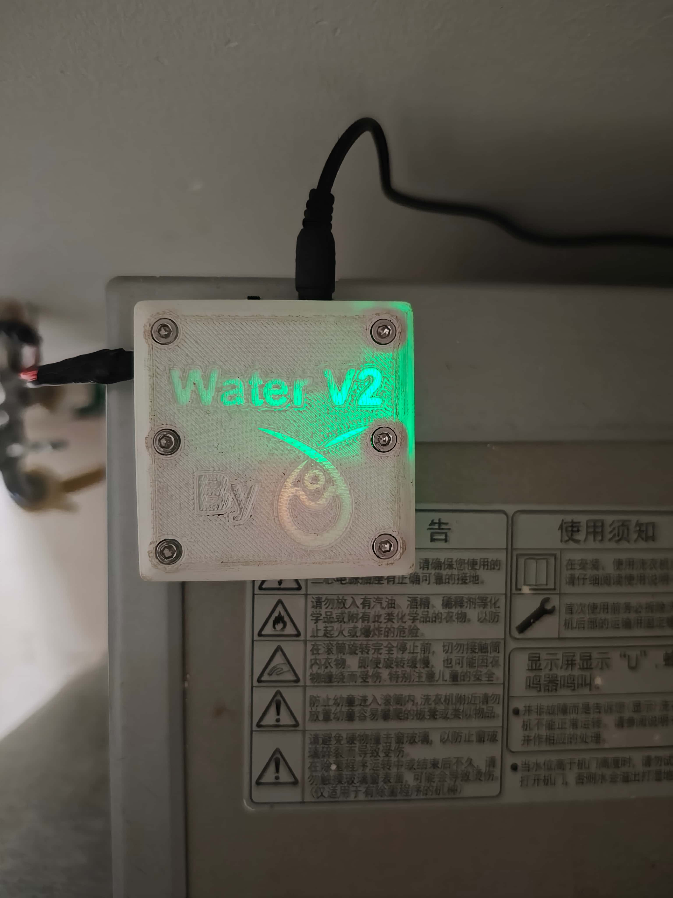
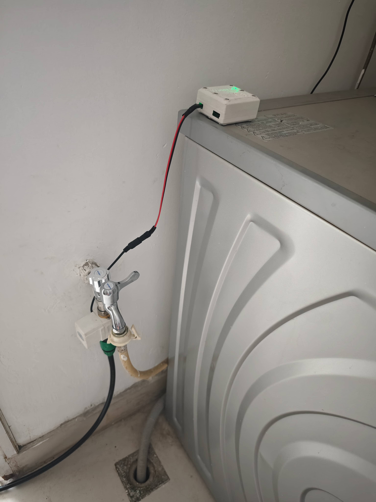

设计出ESP32主机之后，还需要一个外壳。毕竟，如果电路板长时间放置在能接触到水的环境附近，很可能出问题。

因此，我使用Autodesk Fusion设计了外壳。外壳分为上下两部分，用6枚螺丝连接。

{{video::"../../images/water/5/1.mp4"}}

{{video::"../../images/water/5/2.mp4"}}

{{video::"../../images/water/5/3.mp4"}}

设计完成后，开始3D打印外壳。

{{video::"../../images/water/5/4.mp4"}}

{{video::"../../images/water/5/5.mp4"}}

组装起整个主机，并开始工作：

