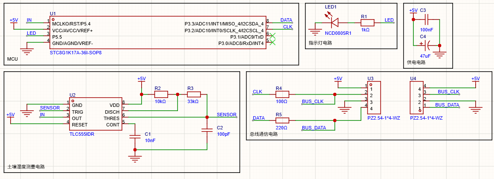
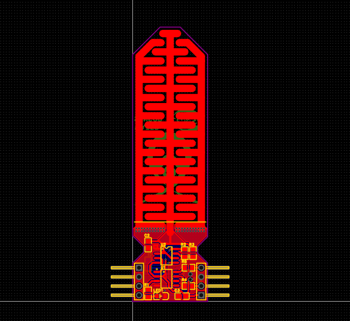
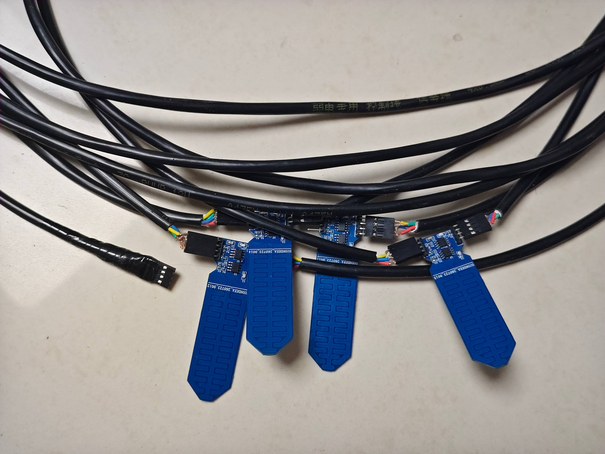
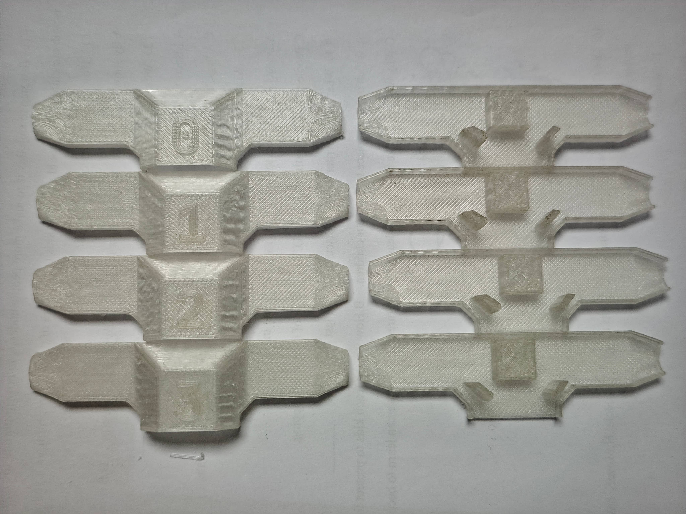
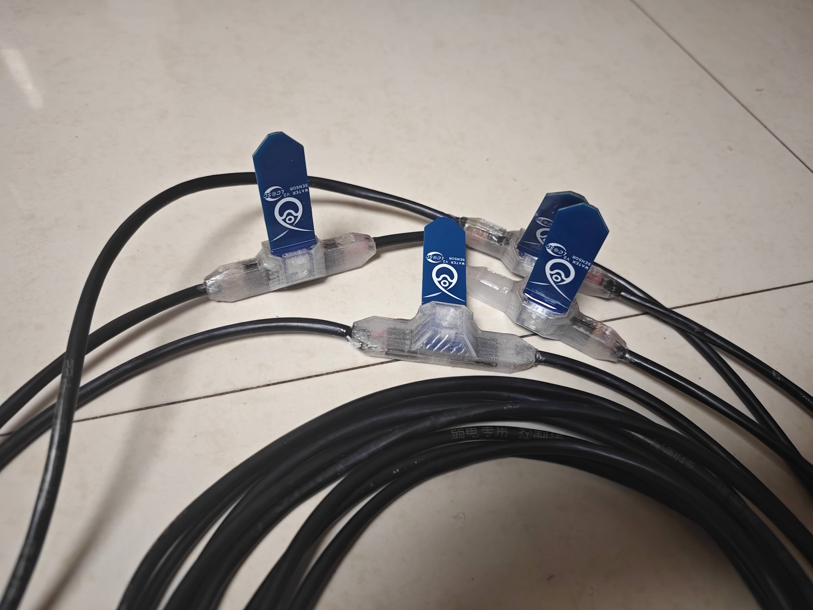
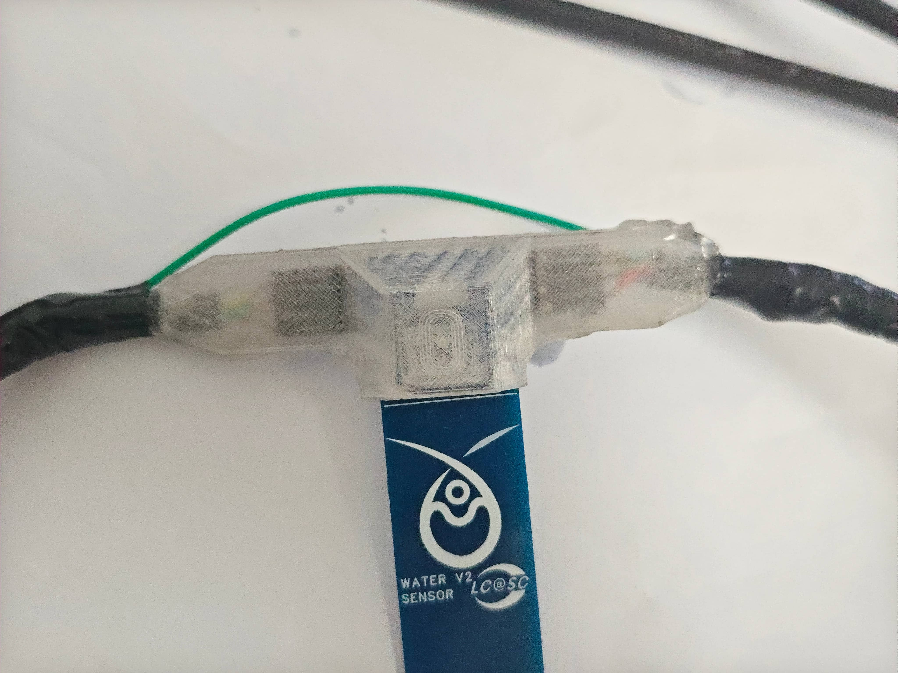
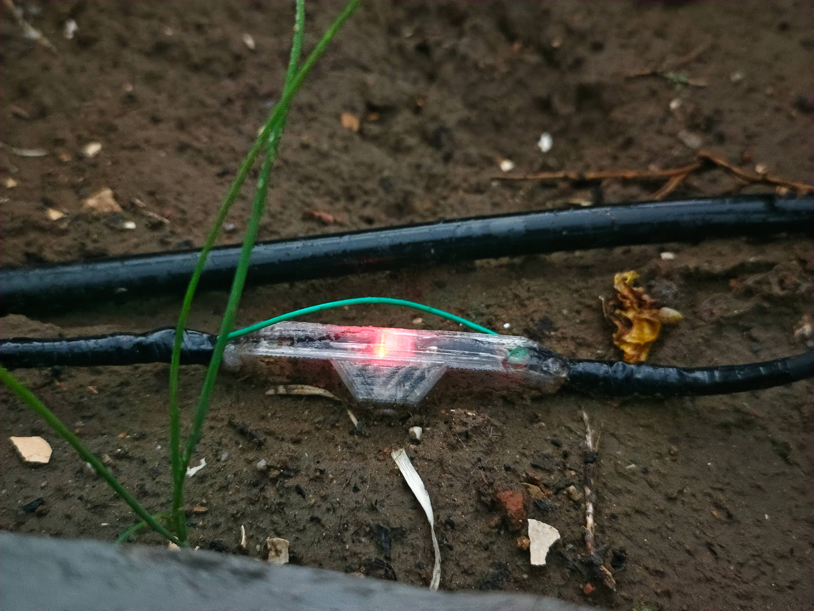
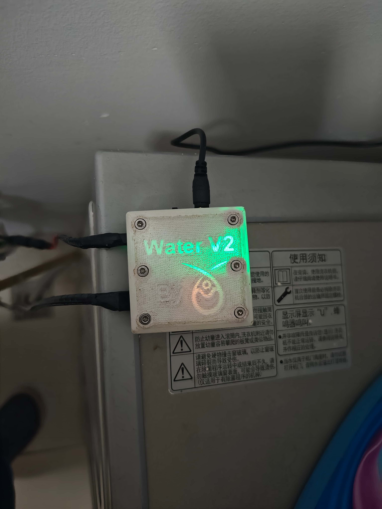

自动灌溉系统的土壤湿度传感器由基于STC8G1K17A的从机担任。我本来想直接使用成品土壤湿度传感器，但这种传感器输出的是模拟信号，多个传感器无法串联，而且通过较长的线缆传输信号带来的干扰较大。我研究了土壤湿度传感器的原理：这种传感器在PCB上绘有一组电极，插入土壤后，电极和周围的土壤就形成了一个电容。当土壤湿度改变时，土壤的介电常数将会改变，这一电容的数值也相应改变。同时，传感器上还有一枚555定时器。它输出的脉冲频率与外围电路中的电容有关，因而可以测量土壤湿度。最后，传感器上还有一系列电路将脉冲转换为模拟信号输出。

由于我不需要模拟信号，因此我直接用一枚单片机连接555定时器，通过单片机的脉冲计数器功能测量脉冲数，即可得到土壤电容值。我选择了STC8G1K17A，该单片机成本极低，以不到1元的价格就能买到。

从机电路结构比较简单：

设计PCB：

{{video::"../../images/water/6/3.mp4","loop"}}

焊接：

{{video::"../../images/water/6/5.mp4"}}

我的ESP32软件最多允许连接16个传感器。不过，我只制作了4个。用导线将4个传感器串联：

3D打印外壳：

{{video::"../../images/water/6/6.mp4"}}

由于土壤湿度传感器需要暴露在室外，我之前用的PLA耗材由于是可降解材料，无法用来制作外壳。我特意使用了半透明PETG耗材，这样可以允许传感器上的LED灯透过外壳显示状态信息。

之后，组装外壳并在其中灌满环氧树脂，以防传感器进水短路。在这一步，我本来想使用普通的AB胶树脂，但其流动性太高，固化太慢，直接从外壳的缝隙漏掉了。因此，我又换成了紫外光固化树脂。这种树脂流动性比较差，而且可以先用树脂粘住缝隙，通过紫外线使其固化，再灌入其他树脂。

在测试传感器的阶段，我发现有一个触点断开了，可能是接线时就没有接好，灌树脂时树脂填充了排针与母座的缝隙。幸好从机的两侧排针是完全相同的，我增加一根飞线绕过了接触不良的触点，四个传感器正常运行。

将传感器埋在土中并与主机连接，至此，项目的硬件全部完工。

